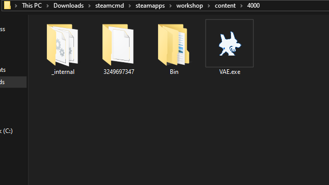
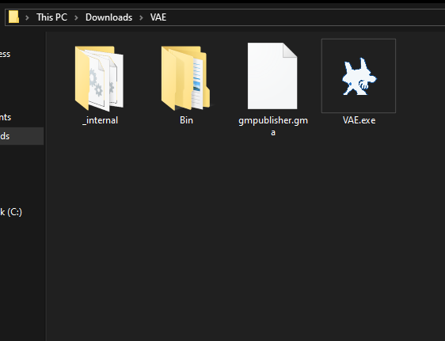

# Vermeil's Addon Extractor (VAE)

**VAE** is a command-line tool for players of Garry's Mod who need to extract content from addon files. This utility supports both modern `.gma` addons and legacy `.bin` addons, a tool for players who download addons from sources such as SteamCMD, third-party programs, websites, or for those using cracked versions of the game.

## Key Features

- 🖥️ Cross-Platform: Works on Windows, macOS, and Linux.
- 📦 Addon Extraction: Extract both modern `.gma` and legacy `.bin` addon formats.
- 🔄 Archive Extraction: Supports archive formats (`.zip`, `.rar`, `.7z`, `.tar`, `.tar.gz`, `.tar.xz` and `.tar.bz2`).
- ⚡ Multithreading: Utilizes concurrent processing to speed up extraction.
- 🛠️ Easy to Use: A simple command-line interface.
- 🔄 GWTool Replacement: Drop-in replacement for GWTool.

## System Requirements

- **RAM:** 20 MB
- **Disk Space:** 40 MB

| **Operating System** | **Supported Versions**                                   | **Architecture** |
|----------------------|----------------------------------------------------------|------------------|
| **Windows**          | 11, 10, 8.1, 8                                           | 64-bit           |
| **Linux**            | Debian 12, Ubuntu 22.04, Fedora 42, Arch Linux, OpenSUSE | 64-bit           |
| **macOS**            | 15, 14, 13, 12, 11, 10.15                                | ARM64            |

## How to Install

1. **Download the Latest Release:**  
   Visit the [latest release page](https://github.com/VermeilChan/VAE/releases/latest).

2. **Choose the Correct File:**
   - **Windows:** `VAE-2.x.x-Windows-x64.zip`
   - **Linux:** `VAE-2.x.x-Linux-x64.tar.zip`
   - **macOS:** `VAE-2.x.x-macOS-ARM64.zip`

3. **Extract the Archive:**  
   Extract the downloaded file to get the VAE files.

## How to Use VAE

### Step 1: Place VAE in Your Addons Folder

- **For SteamCMD Users:**  
  Copy VAE to the directory where your addons are stored (e.g., `path-to-steamcmd/steamapps/workshop/content/4000`).

- **For Other Users:**  
  Place VAE in the directory with your addon archives or folders. VAE will automatically scan the current directory and its subdirectories.

### Step 2: Run VAE

When you start the program, you will see two options:

#### Option 1: Extract Addons

- **What It Does:**  
  Scans the current directory and its subdirectories for `.gma` and `.bin` files.
  
- **After Extraction:**  
  The extracted files are saved in the `Extracted-Addons` folder. Simply copy these folders into your Garry's Mod addon directory.

#### Option 2: Extract Archives

- **What It Does:**  
  Searches for archive files (like `.zip`, `.rar`, `.7z`, etc.) and extracts them.
  
- **After Extraction:**  
  A folder named `Leftover` will be created. This folder contains the original `.gma`, `.bin`, and archive files. You can delete it later to free up space.

## Building VAE from Source

Please refer to the [build instructions](BUILD.md) for details on building VAE from source.

## Contributing

Contributions are welcome! Please submit a pull request or open an issue to discuss changes.

## License

This project is licensed under the [GNU General Public License v3.0](LICENSE).

## Credits

- **[PyInstaller](https://www.pyinstaller.org/):** For creating standalone executables.
- **[Py7zr](https://pypi.org/project/py7zr/):** For 7z file extraction.
- **[RarFile](https://pypi.org/project/rarfile/):** For extracting rar files.
- **[FastGMAD](https://github.com/WilliamVenner/fastgmad):** Fast reimplementation of gmad (forked).
- **[7-zip](https://www.7-zip.org/):** For extracting `.bin` files.
- **[Program Icon](https://evangelion.fandom.com/wiki/Adam):** From *Neon Genesis Evangelion* (Adam).
