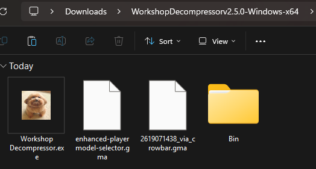

# Workshop Decompressor

**Workshop Decompressor** is a command-line tool for players of Garry's Mod who need to extract content from addon files. This utility supports both modern `.gma` addons and legacy `.bin` addons, a tool for players who download addons from sources such as SteamCMD, third-party programs, websites, or for those using cracked versions of the game.

## Key Features

- Cross-Platform: Works on Windows, macOS, and Linux.
- Addon Extraction: Extract both modern `.gma` and legacy `.bin` addon formats.
- Archive Extraction: Supports archive formats (`.zip`, `.rar`, `.7z`, `.tar`, `.tar.gz`, `.tar.xz` and `.tar.bz2`).
- Multithreading: Utilizes concurrent processing to speed up extraction.
- Easy to Use: A simple command-line interface.
- Drop-in replacement for GWTool.

## System Requirements

**RAM Usage:** 30MB 
**Disk Space:** 40MB

| Operating System | Supported Versions                                         | Architecture |
|------------------|------------------------------------------------------------|--------------|
| Windows          | 11, 10 (1809 or later)                                     | 64-Bit       |
| GNU/Linux        | Debian 13, Ubuntu 24.04.3, Fedora 43, Arch Linux, OpenSUSE | 64-Bit       |
| macOS            | 15, 14, 13, 12                                             | ARM64        |

## How to Install

Download the Latest Release:
   Visit the [latest release page](https://github.com/Mitra-88/WorkshopDecompressor/releases/latest).

## How to Use Workshop Decompressor

### **Step 1: Put the program where your addons are**

**If you use SteamCMD:**
Drop the Workshop Decompressor EXE into this folder:
`steamcmd/steamapps/workshop/content/4000`
That’s where all your downloaded GMod addons live.

**If you use anything else (web downloads, random folders, cracked GMod, etc.):**
Put Workshop Decompressor in the same folder where your `.gma`, `.bin`, or archive files are.

That’s it.
The program scans **the folder it’s in** and **every subfolder**, automatically.

### Step 2: Run Workshop Decompressor

When you start the program, you will see two options:

#### Option 1: Extract Addons

- What It Does:
  Scans the current directory and its subdirectories for `.gma` and `.bin` files.
  
- After Extraction:
  The extracted files are saved in the `Extracted-Addons` folder. Simply copy these folders into your Garry's Mod addon directory.

#### Option 2: Extract Archives

- What It Does:
  Searches for archive files (like `.zip`, `.rar`, `.7z`, etc.) and extracts them.
  
- After Extraction:
  A folder named `Leftover` will be created. This folder contains the original `.gma`, `.bin`, and archive files. You can delete it later to free up space.

## Building Workshop Decompressor from Source

Please refer to the [build instructions](BUILD.md) for details on building Workshop Decompressor from source.

## Contributing

Contributions are welcome! Please submit a pull request or open an issue to discuss changes.

## License

This project is licensed under the [GNU General Public License v3.0](LICENSE).

## Credits

- [PyInstaller](https://www.pyinstaller.org/): For creating standalone executables.
- [Py7zr](https://pypi.org/project/py7zr/): For 7z file extraction.
- [RarFile](https://pypi.org/project/rarfile/): For extracting rar files.
- [FastGMAD](https://github.com/WilliamVenner/fastgmad): Fast reimplementation of gmad (forked).
- [7-zip](https://www.7-zip.org/): For extracting `.bin` files.
